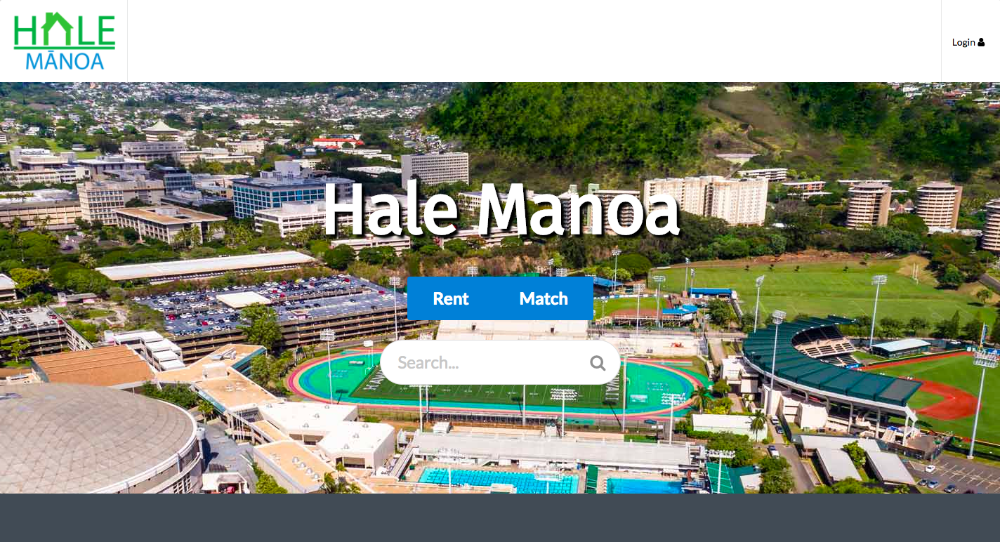

--
layout: project
type: project
image: images/halemanoa.png
title: Hale Manoa
permalink: projects/halemanoa
# All dates must be YYYY-MM-DD format!
date: 2018-05-07
labels:
  - Software Engineering
  - Website Development
  - Meteor
  - React
  - JSX
summary: My team designed a website for users to find roommates and off campus housing. 
---

  

Hale Manoa was my group's final project for ICS 314 (Software Engineering I) at the University of Hawaii at Manoa. The purpose of the website was to allow users to find potential roommates in addition to finding off campus housing. Additionally, it is available for potential renters to make listings for housing that they wish to rent to students. 

For this project, I was responsible for generating user profiles, styling all the pages, and creating a rating system for users. Some valuable experiences I gained from this project included time management and Issue Driven Project Management. This was my first time using IDPM and it was an effective memes in dividing work up between our group in addition to organizing what needed to be done overall. Aside from the experiences, I gained more familiarity in using JSX and React to make a web application. 

Here you can see the landing page for our website: 

Documentation for our development process can be found [here:](http://www.hale-manoa.github.io)

The source code can also be found [here:](https://github.com/hale-manoa/hale-manoa)
